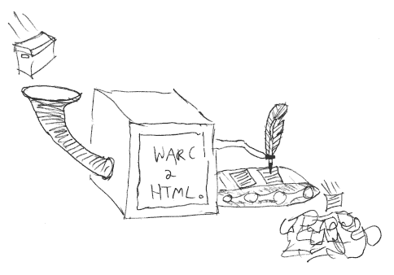

warc2html 
=========

Converts WARC files to static html while rewriting links to relative URLs suitable for browsing offline or re-hosting
using a standard web server. 

Limitations:
* Links in JavaScript are not rewritten
* Assumes there's only one snapshot of each URL in the input
* Does not handle resource records (yet)

Usage
-----

To convert a file named example.warc.gz to static HTML:

    java -jar warc2html.jar -o output/ example.warc.gz

Alternatively if you'd like to convert a subset of records you can supply a list of records in CDX11 format and the
path or URL where your WARC files are stored:

    java -jar warc2html.jar -o output/ -b http://server/warcs/ example.cdx

Compiling
---------

Install [OpenJDK 11](https://adoptium.net/) or later and [Apache Maven](https://maven.apache.org/) then compile with:

    mvn package

File renaming
-------------

Files are renamed to remove characters like "?" that are disallowed on some systems. File extensions are updated or added
based on the Content-Type header according to [these rules](resources/org/netpreserve/warc2html/forced.extensions).

URLs ending in / will be saved as index.html. Where two WARC records would produce the same filename they are
disambiguated by adding a number like ~1, ~2, ~3 to the end of the filename. 

License
-------

Copyright 2021 National Library of Australia \
License: [Apache 2.0](LICENSE)
